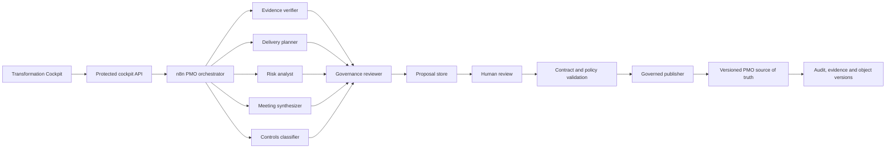

# Governed agent architecture target

## Boundaries

- The orchestrator validates routing and coordinates specialists; it does not decide approval.
- Specialists return evidence-bound proposals through `agent-run-1.0` and never write canonical PMO state.
- The governance reviewer verifies completeness, evidence and policy, but cannot publish.
- Human review accepts or rejects proposals with accountable rationale.
- The publisher is the only agent-path writer. It revalidates authorization, schema, evidence, object version and idempotency immediately before persistence.
- Every execution retains correlation, workflow, prompt and model versions so a result can be evaluated or replayed without rewriting history.

## Delivery transition

The existing live workflow remains a monolith and currently writes directly. ZM-PROD-05A exposes that fact as `persistence.mode = legacy_direct`. ZM-PROD-05B separates specialist execution. ZM-PROD-05C removes direct specialist/orchestrator writes and introduces the proposal/review/publisher boundary.

