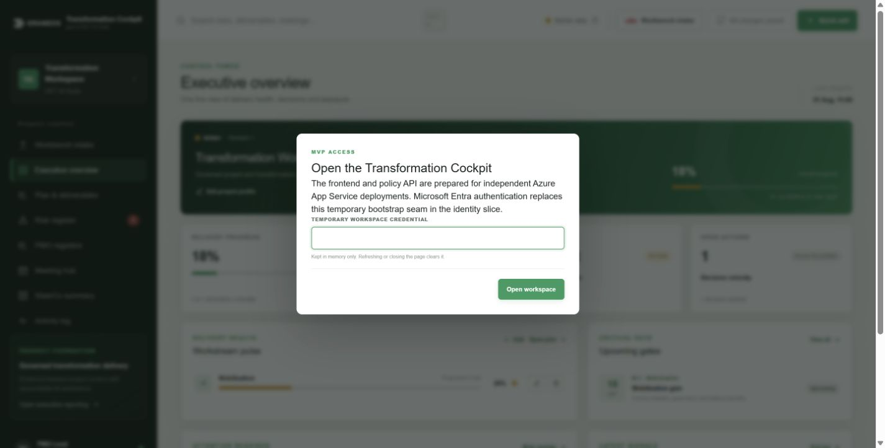
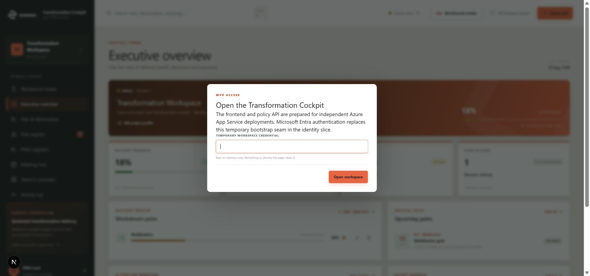

# ZM-PROD-04 implementation report

## Outcome

The Transformation Cockpit now uses an Eraneos product design system while preserving PMO behavior, schemas, fixtures, n8n workflow identifiers and persistence contracts. The supplied Eraneos mark replaces the former CSS approximation. The UI remains English-only and contains no restricted client references or dependencies.

## Visual evidence

### Before

### After

Both screenshots show the MVP access boundary so the same application state can be compared. Responsive smoke tests additionally capture authenticated dashboard views at desktop, tablet and mobile widths during test execution.

## Main changes

- Added centralized Eraneos brand, surface, interaction, status, radius, shadow and focus tokens.
- Converted navigation, heroes, cards, forms, tables, registers, AI intake and SteerCo reporting to the warm-neutral/orange product language.
- Preserved independent semantic colors for success, warning, danger and unknown states.
- Added the approved mark under `public/brand` and a reusable accessible `BrandMark` component.
- Added keyboard-focus, forced-colors and responsive checks.
- Documented typography fallback, token intent and asset provenance.

## Verification

- `npm run lint` — passed.
- `npm run typecheck` — passed.
- `npm run test:e2e` — 18 tests passed.
- `npx playwright test tests/visual-design.spec.ts` — 4 visual smoke tests passed.
- `npm run build:pages` — production static export passed.
- `npm run test:pages` — GitHub Pages base-path and asset test passed.
- Public-bundle credential and licensed-content scan — passed.
- Repository and generated-output client-neutrality scan — no matches.
- Browser review — no console warnings/errors and no horizontal overflow at desktop width.

## Outstanding brand input

The supplied mark is a small raster source. An official vector mark/wordmark would improve high-density rendering. Mona Sans and Eraneos Display remain unbundled until approved, distributable webfont files and licensing guidance are supplied.
